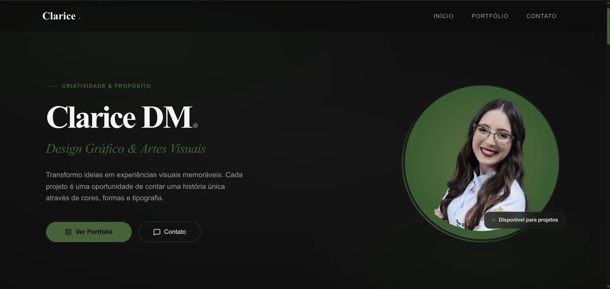
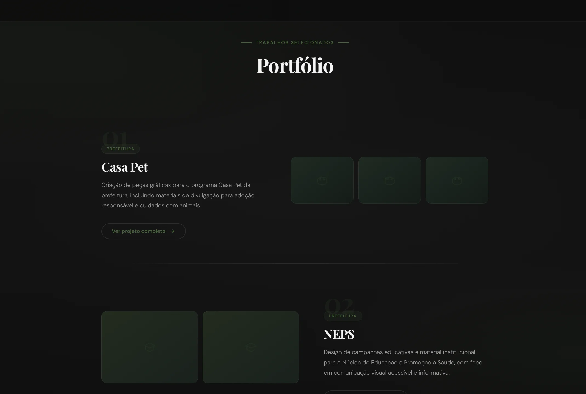
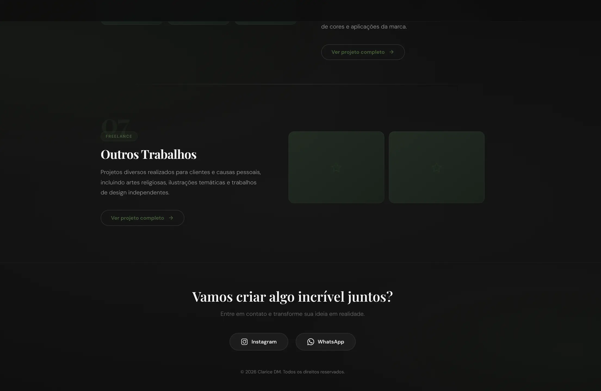
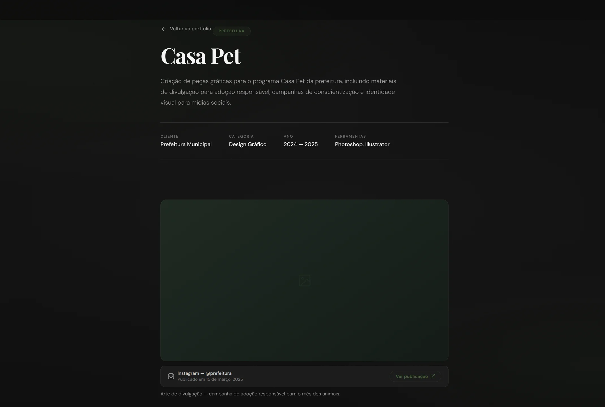
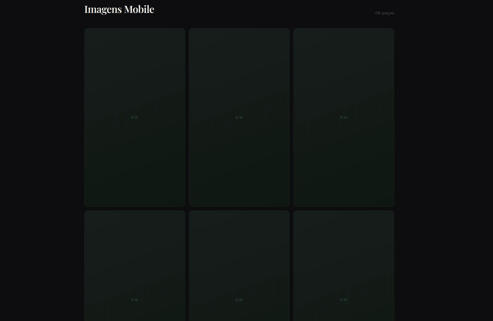
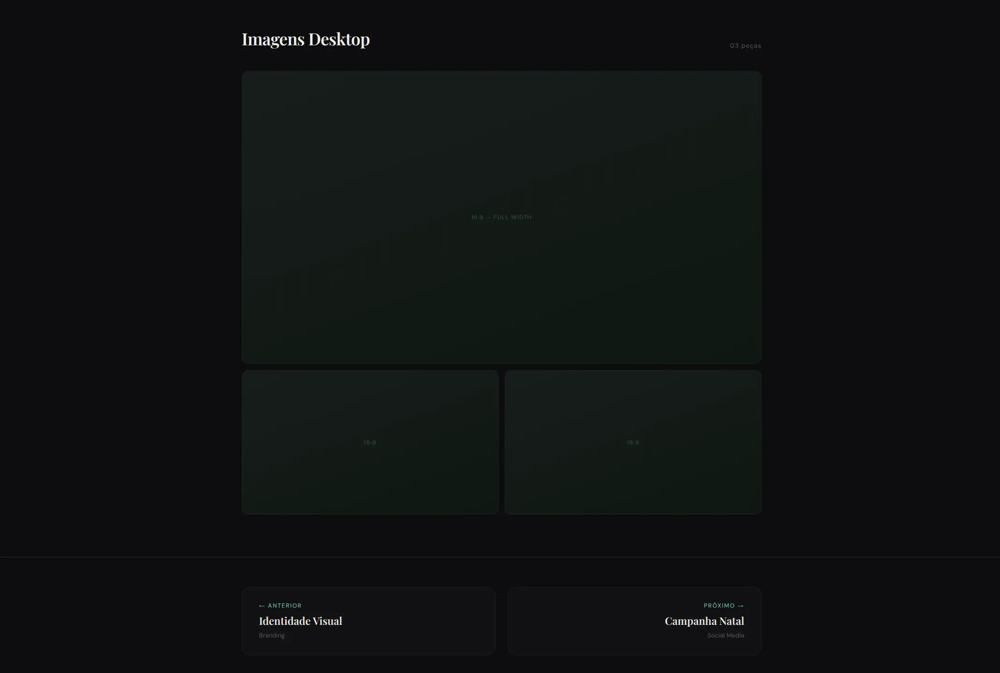

# 🎨 Portfólio de Design — Clarice DM

## 🇧🇷 Sobre o projeto

Este é um portfólio de projetos de design gráfico desenvolvidos ao longo dos últimos anos, incluindo trabalhos institucionais, acadêmicos e freelance.

Os projetos envolvem:

- Criação de identidade visual
- Peças para redes sociais
- Materiais institucionais
- Campanhas educativas e públicas

---

## 🇺🇸 About the project

This is a portfolio showcasing graphic design projects developed over the past few years, including institutional, academic, and freelance work.

Projects include:

- Visual identity design
- Social media content
- Institutional materials
- Educational and public campaigns

---

## 🛠️ Tecnologias / Technologies

- React / Vite
- TypeScript
- Tailwind CSS
- UI Components
- Responsive Design

---

## 📸 Preview do Projeto / Project Preview

  
  
  

  
  
  

---

## 🚀 Funcionalidades / Features

- Navegação dinâmica entre projetos
- Visualização de imagens em Lightbox
- Layout responsivo (mobile e desktop)
- Organização por categorias
- Integração com publicações (Instagram)
